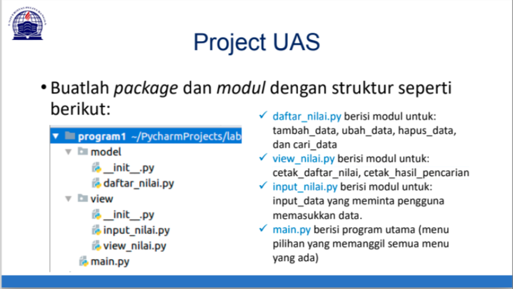
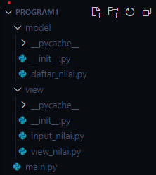
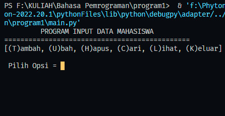
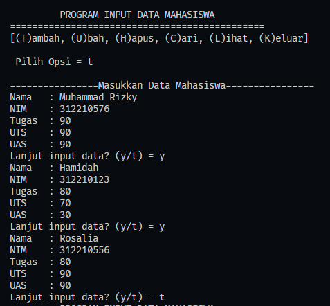
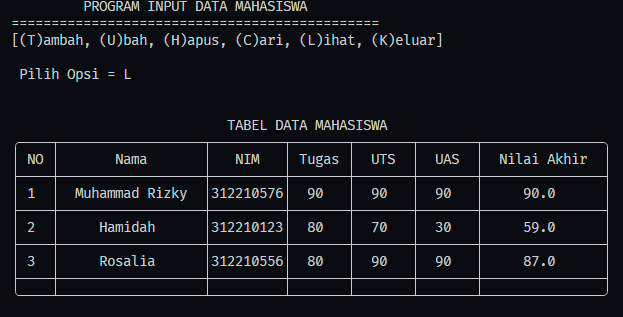
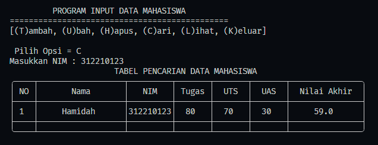
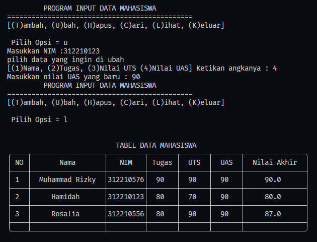
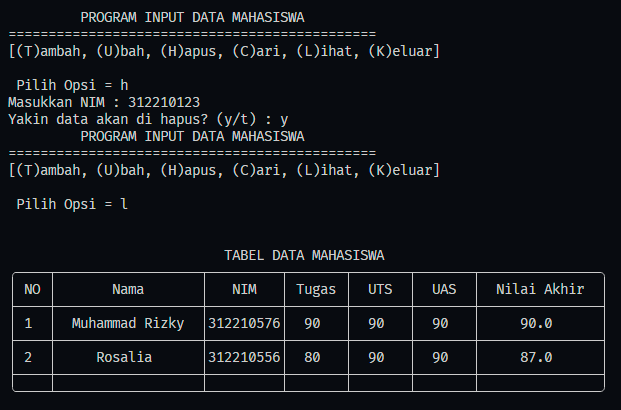

# PROJEK UAS BAHASA PEMROGRAMAN
___
Nama    : Muhammad Rizky<br>
NIM     : 312210576<br>
Kelas   : TI.22.B2<br>
Mapel   : Bahasa Pemrograman<br>

**Daftar isi**
> * [PROJEK UAS](#projek-uas)
> * [PENJELASAN PROGRAM](#penjelasan-program)
> * [HASIL RUN PROGRAM](#hasil-run-program)

# `LINK YOUTUBE PENJELASAN PROGRAM`


# `PDF PENJELASAN PROGRAM`
[PDF_MUHAMMAD_RIZKY](Bahasa Pemrograman UAS.pdf)

# `PROJEK UAS`
<br>

# `PENJELASAN PROGRAM`
1. Pertama buat Package dan modul dengan struktur di bawah ini

    * Note : tanpa folder ```__pychace__```

2. Buka file ```__init__.py``` di folder ```model``` dan ketikan code berikut 
    ```python
    from .daftar_nilai import *
    ```
    * adanya ```__init__.py``` menandakan bahwa folder ```model``` adalah package dan code yang ada di dalamnya berfungsi agar memudahkan kita saat mengimport modul ke file lain<br>

3. Setelah itu buka File ```daftar_nilai.py```, disini kita akan membuat sebuah fungsi tambah_data, ubah_data, hapus_data, dan cari_data
    ```python
    class daftarNilai():
    
        def __init__(self):
            self.mahasiswa = {}

        mydict = daftarNilai()
    ```
    * Pertama kita buat class bernama ```daftarNilai()``` dan fungsi ```__init__```, disini saya menggunakannya untuk menyimpan Dictionary, yang saya akan jadikan Database untuk hasil input dari user. saya juga membuat sebuah variabel ```mydict``` yang mendeskripsikan ```daftarNilai()``` agar program yang di jalankan menjadi tersusun<br>
    ```python
    def tambah_data(KEY, nama, nim, tugas, uts, uas, nilaiAkhir):
        data = dict.fromkeys(mydict.mahasiswa.keys())
        data["nama"] = nama
        data["nim"] = nim
        data["tugas"] = tugas
        data["uts"] = uts
        data["uas"] = uas
        data["nilaiAkhir"] = nilaiAkhir
        mydict.mahasiswa.update({KEY:data})
    ```
    * Kedua kita buat fungsi ```tambah_data()```, fungsinya untuk menambahkan hasil inputan user ke dalam dictionary. Disini saya membuat nim dari mahasiswa untuk dijadikan sebuah key value di dictionary<br>
    ```python
    def ubah_data():
        nims = int(input("Masukkan NIM : "))
        if nims in (mydict.mahasiswa.keys()):
            print("Pilih data yang ingin di ubah")
            ubah = int(input("[(1)Nama, (2)Tugas, (3)UTS, (4)UAS] Ketikan angkanya = "))
            if ubah == 1:
                newNama = input("Masukkan Nama Baru : ")
                mydict.mahasiswa[nims]["nama"] = newNama
            elif ubah == 2:
                newTugas = int(input("Masukkan Nilai Tugas Baru : "))
                mydict.mahasiswa[nims]["tugas"] = newTugas
                nilaiAkhir = (mydict.mahasiswa[nims]["tugas"] * 30 / 100) + (mydict.mahasiswa[nims]["uts"] * 35 / 100) + (mydict.mahasiswa[nims]["uas"] * 35 / 100)
                mydict.mahasiswa[nims]["nilaiAkhir"] = nilaiAkhir
            elif ubah == 3:
                newUTS = int(input("Masukkan Nilai UTS Baru : "))
                mydict.mahasiswa[nims]["uts"] = newUTS
                nilaiAkhir = (mydict.mahasiswa[nims]["tugas"] * 30 / 100) + (mydict.mahasiswa[nims]["uts"] * 35 / 100) + (mydict.mahasiswa[nims]["uas"] * 35 / 100)
                mydict.mahasiswa[nims]["nilaiAkhir"] = nilaiAkhir
            elif ubah == 4:
                newUAS = int(input("Masukkan Nilai Tugas Baru : "))
                mydict.mahasiswa[nims]["uas"] = newUAS
                nilaiAkhir = (mydict.mahasiswa[nims]["tugas"] * 30 / 100) + (mydict.mahasiswa[nims]["uts"] * 35 / 100) + (mydict.mahasiswa[nims]["uas"] * 35 / 100)
                mydict.mahasiswa[nims]["nilaiAkhir"] = nilaiAkhir
        else:
            print("NIM yang anda inputkan belum ada")
            input("Tekan enter untuk melanjutkan")
    ```
    * Ketiga kita buat fungsi ```ubah_data()```, fungsinya untuk mengubah hasil inputan user yang ada di dictionary. Disini saya membuat nim untuk dijadikan kunci untuk merubah data yang ada di dictionary, dan user hanya bisa mengubah Nama, Nilai Tugas, UTS, dan UAS.<br>
    ```python
    def hapus_data():
        nims = int(input("Masukkan NIM : "))
        if nims in (mydict.mahasiswa.keys()):
            delet = input("yakin data dengan NIM mau di hapus? (y/t) : \a")
            if delet == "y":
                del mydict.mahasiswa[nims]
            else:
                print("data tidak jadi di hapus")
        else:
            print("NIM yang anda inputkan belum ada")
            input("Tekan enter untuk melanjutkan")
    ```
    * Keempat kita buat fungsi ```hapus_data()```, fungsinya untuk menghapus inputan user yang ada di dictionary. Disini saya membuat nim untuk dijadikan kunci untuk menghapus data yang ada di dictionary. untuk jalannya program pertama user menginputkan NIM yang ingin di hapus, lalu program akan mengecek apakah nim yang di inputkan ada di dalam dictionary, jika ada data bisa di hapus.<br>
    ```python
    def cari_data():
        nims = int(input("Masukkan NIM : "))
        if nims in (mydict.mahasiswa.keys()):
            view.view_nilai.cetak_hasil_pencarian(nims)
        else:
            print("NIM yang anda inputkan belum ada")
            input("Tekan enter untuk melanjutkan")
    ```
    * Kelima kita buat fungsi ```cari_data()```, fungsinya untuk mencari hasil inputan user yang ada di dictionary. Disini saya membuat nim untuk dijadikan kunci untuk mencari data yang ada di dictionary.<br>

4. Buka file ```__init__.py``` di folder ```view``` dan ketikan code berikut 
    ```python
    from .input_nilai import *
    from .view_nilai import *
    ```
    * adanya ```__init__.py``` menandakan bahwa folder ```view``` adalah package dan code yang ada di dalamnya berfungsi agar memudahkan kita saat mengimport modul ke file lain<br> 

5. buka File ```input_nilai.py```, disini kita akan membuat sebuah fungsi ```input_data``` yang meminta pengguna memasukkan data.
    ```python
    from model import daftarNilai

    class inputNilai():
        def input_data(loop):
                print ("\n════════════Masukan Data Mahasiswa════════════")
                while(loop == "y"):
                    nama = input("NAMA    : ")
                    nim = int(input("NIM     : "))
                    tugas = int(input("tugas   : "))
                    uts = int(input("uts     : "))
                    uas = int(input("uas     : "))
                    nilaiAkhir = (tugas * 30 / 100) + (uts * 35 / 100) + (uas * 35 / 100)
                    KEY = nim
                    daftarNilai.tambah_data(KEY, nama, nim, tugas, uts, uas, nilaiAkhir)
                    loop = input("Lanjut input data? (y/t) = ")
                while(loop == "t"):
                    break
    ```
    * Pertama Import ```daftarNilai``` dari folder ```model``` untuk menjalankan fungsi ```tambah_data()```. Disini buat sebuah class ```inputNilai()``` lalu buat sebuah fungsi ```input_data```. Saat program jalan user di minta inputkan nama, nim, tugas, uts, dan uas. programnya akan mentotal hasil nilai dan menjadikan nim user menjadi key value di dalam dictionary. data yang di inputkan user akan masuk ke data base dengan menjalankan fungsi ```tambah_data()```.<br>
  
6. buka File ```view_nilai.py```, disini kita akan membuat sebuah fungsi cetak_daftar_nilai dan cetak_hasil_pencarian.
    ```python
    from model import daftar_nilai

    def cetak_daftar_nilai():
        no = 0
        print("\n")
        print(f"{'TABEL DATA MAHASISWA':^75}")
        print("╭────┬──────────────────┬─────────┬───────┬───────┬───────┬───────────────╮")
        print(f"│{'NO':^4}│{'Nama':^18}│{'NIM':^9}│{'Tugas':^7}│{'UTS':^7}│{'UAS':^7}│{'Nilai Akhir':^15}│")
        print("├────┼──────────────────┼─────────┼───────┼───────┼───────┼───────────────┤")

        for nim in mydict.mahasiswa:
            no += 1
            KEY = nim

            NAMA = mydict.mahasiswa[KEY]['nama']
            NIM = mydict.mahasiswa[KEY]['nim']
            TUGAS = mydict.mahasiswa[KEY]['tugas']
            UTS = mydict.mahasiswa[KEY]['uts']
            UAS = mydict.mahasiswa[KEY]['uas']
            AKHIR = mydict.mahasiswa[KEY]['nilaiAkhir']
        
            print(f"│{no:^4}│{NAMA:^18}│{NIM:^9}│{TUGAS:^7}│{UTS:^7}│{UAS:^7}│{AKHIR:^15}│")
            print("├────┼──────────────────┼─────────┼───────┼───────┼───────┼───────────────┤")
            
        print("╰────┴──────────────────┴─────────┴───────┴───────┴───────┴───────────────╯")
        print("\n")
    ```
    * import ```daftar_nilai()``` dari folder model untuk mengambil data yang ada di dictionary. lalu buat fungsi ```cetak_daftar_nilai()``` untuk mencetak keseluruhan data yang ada di dictionary ke dalam sebuah tabel. Buat deklarasi ```no = 0``` untuk membuat pengulangan number di tabel. Buat sebuah tabel dan buat pengulangan dengan menggunakan key value untuk mengambil data di dictionary dan susun data yang akan di masukkan ke tabel. <br>
    ```python
    def cetak_hasil_pencarian(nims):
    print(f"{'TABEL PENCARIAN DATA MAHASISWA':^75}")
    print("╭────┬──────────────────┬─────────┬───────┬───────┬───────┬───────────────╮")
    print(f"│{'NO':^4}│{'Nama':^18}│{'NIM':^9}│{'Tugas':^7}│{'UTS':^7}│{'UAS':^7}│{'Nilai Akhir':^15}│")
    print("├────┼──────────────────┼─────────┼───────┼───────┼───────┼───────────────┤")
    no = 1
    KEY = nims

    NAMA = mydict.mahasiswa[KEY]['nama']
    NIM = mydict.mahasiswa[KEY]['nim']
    TUGAS = mydict.mahasiswa[KEY]['tugas']
    UTS = mydict.mahasiswa[KEY]['uts']
    UAS = mydict.mahasiswa[KEY]['uas']
    AKHIR = mydict.mahasiswa[KEY]['nilaiAkhir']

    print(f"│{no:^4}│{NAMA:^18}│{NIM:^9}│{TUGAS:^7}│{UTS:^7}│{UAS:^7}│{AKHIR:^15}│")
    print("├────┼──────────────────┼─────────┼───────┼───────┼───────┼───────────────┤")   
    print("╰────┴──────────────────┴─────────┴───────┴───────┴───────┴───────────────╯")
    print("\n")

    mydict = daftar_nilai.mydict
    ```
    * Buat sebuah fungsi ```cetak_hasil_pencarian(nims)``` dan berikan argumen nims agar fungsi ```cari_data()``` yang di dalamnya meminta user untuk menginputkan nim agar bisa masuk ke fungsi ```cetak_hasil_pencarian(nims)``` dan mencetak hasil pencarian yang menggunakan key value nim. buat juga variabel ```mydict``` yg di dalamnya berisi ```dafta_nilai.mydict``` untuk mengambil data yang ada di dictionary<br>
  
7. Buka file ```main.py``` untuk Pembuatan Opsi Run dari method yang sudah di buat
    ```python
    from view import view_nilai, input_nilai
    from model.daftar_nilai import daftarNilai

    while True:
        print('{0:^46}'.format("PROGRAM INPUT NILAI MAHASISWA"))
        print('{0:^46}'.format("="*46))
        # print("\n")
        print("[(T)ambah, (U)bah, (H)apus,(C)ari, (L)ihat, (K)eluar]")
        pilihan = input("\nPilih Opsi= ")

        if pilihan.lower() == "t":
            input_nilai.inputNilai.input_data("y")
        elif pilihan.lower() == "u":
            daftarNilai.ubah_data()
        elif pilihan.lower() == "h":
            daftarNilai.hapus_data()
        elif pilihan.lower() == "c":
            daftarNilai.cari_data()
        elif pilihan.lower() == "l":
            view_nilai.cetak_daftar_nilai()
        elif pilihan.lower() == "k":
            break
        else:
            print("Opsi yang anda pilih tidak ada di menu")
            input("Tekan enter untuk melanjutkan")
    ```
    * Pertama import view_nilai, input_nilai, dan daftarNilai dari folder view dan model<br>
    * Buat sebuah Pengulangan yang di dalamnya terdapat statement If/else dengan pilihan opsi Tambah, Ubah, Hapus, Cari, Lihat, Dan Keluar (untuk menyelesaikan Program). <br>
    * Buat inputan yang bisa memanggil method tambah dengan menginputkan huruf "T", Method ubah dengan menginputkan huruf "U", Method hapus dengan menginputkan huruf "h",Method cari dengan menginputkan huruf "C". Method lihat dengan menginputkan huruf "L", dan input "K" untuk keluar dari program. Untuk method - methodnya di ambil dari package & module yang sudah kita buat sebelumnya <br> 

## `Hasil RUN PROGRAM`
### Pemilihan Opsi

### Menambahkan Data

### Melihat Data

### Mencari data

### Mengubah Data

### Menghapus Data


### Sekian Terimakasih...
